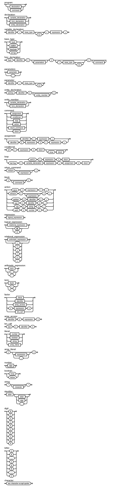

# Contexto

## Level
       Level é uma linguagem de programação de alto nível desenvolvida para a criação de jogos de RPG executados em ambiente de terminal. Seu objetivo é proporcionar uma forma estruturada de implementar elementos fundamentais de um jogo, como movimentação, diálogos, interações com NPCs e sistemas de combate.

## GameVM
       A linguagem foi projetada para ser interpretada por uma máquina virtual, a GameVM. Ela é responsável por traduzir e executar as instruções da Level, simulando o comportamento do jogo em tempo real. Dessa forma, é possível desenvolver mecânicas de jogo, narrativas e batalhas diretamente no terminal.


# Para testar

       Deve ser utilizado alguma distribuição do Linux, ou alguma VM para Windows (WSL por exemplo). Ao clonar o repositório, basta rodar no terminal:

```bash
python3 vm/main.py level/test.level
```
       Altere o arquivo de teste livremente para descobrir como histórias/jogos RPG são feitos no próprio terminal.


# Diagrama Sintático

<p align="center">
  
</p>

```ebnf
program = { declaration | command };

declaration = variable_declaration 
            | func_declaration 
            | entity_declaration ;

(* Variables – type is mandatory *)
variable_declaration = identifier, ":", type, "=", expression, ";" ;

(* Types: primitives and arrays (multi-dimensional allowed) *)
type = base_type, { "[]" } ;
base_type = "text" | "number" | "boolean" | "array" ;

(* Functions *)
func_declaration = "func", identifier, "(", [ parameters ], ")", [ ":", type ], "{", { command }, "}" ;
parameters = parameter, { ",", parameter } ;
parameter = identifier, ":", type ;

(* Entities (player, monsters, NPCs, animals, etc.) *)
entity_declaration = "entity", identifier, "{", { entity_member }, "}" ;
entity_member = variable_declaration | func_declaration ;

command = assignment
        | conditional
        | loop
        | action
        | return_command
        | block ;

assignment = identifier, "=", expression, ";" 
           | identifier, "[", expression, "]", "=", expression, ";" ;

conditional = "if", "(", expression, ")", block, [ "else", block ] ;

loop = "until", "(", expression, ")", block
     | "during", "(", variable_declaration, expression, ";", assignment, ")", block ;

return_command = "return", [ expression ], ";" ;

block = "{", { command }, "}" ;

(* Actions *)
action = "move", "(", expression, ")", ";"
       | "attack", "(", [ expression ], ")", ";"
       | "gather", "(", identifier, ")", ";"
       | "use", "(", identifier, ")", ";"
       | "say", "(", string, ")", ";"
       | "wait", "(", number, ")", ";";

(* Expressions *)
expression = logical_expression ;
logical_expression = relational_expression, { ( "&&" | "||" ), relational_expression } ;
relational_expression = arithmetic_expression, { ( "==" | "!=" | "<" | ">" | "<=" | ">=" ), arithmetic_expression } ;
arithmetic_expression = term, { ( "+" | "-" ), term } ;
term = factor, { ( "*" | "/" ), factor } ;
factor = literal 
       | identifier 
       | array_access 
       | "(", expression, ")" 
       | len_call ;

array_access = identifier, "[", expression, "]" ;
len_call = "len", "(", identifier, ")" ;

literal = number | boolean | string | array_literal ;
array_literal = "[", [ expression, { ",", expression } ], "]" ;

number = digit, { digit } ;
boolean = "true" | "false" ;
string = '"', { character }, '"' ;

identifier = letter, { letter | digit | "_" } ;

digit = "0" | "1" | "2" | "3" | "4" | "5" | "6" | "7" | "8" | "9" ;
letter = "a" | "b" | "..." | "z" | "A" | "B" | "..." | "Z" ;
character = ? any character except quotes ? ;
